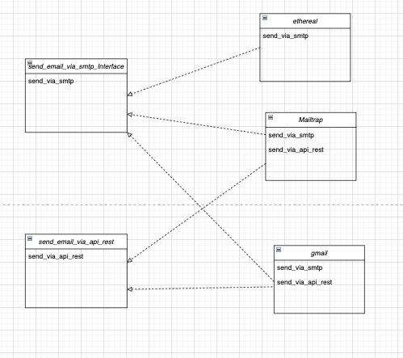
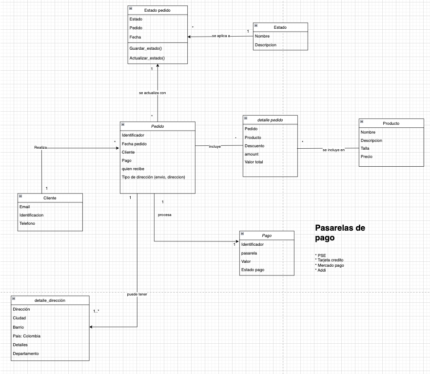

# software-construction-2025-1

interface-segregation-case-one

Modelo implementado:
Se trata de una forma de utilizar diferentes modos de enviar correos electrónicos utilizando algunas herramientas libres

pure-fabrication-case-one
Se trata de una estructura para gestionar un sistema de pedidos en un e-commerce
