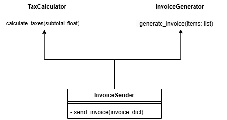
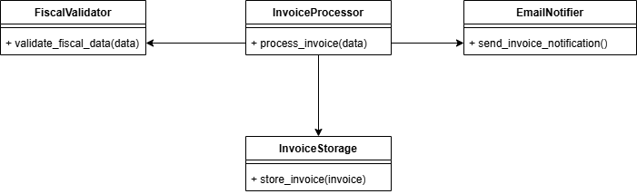

# software-construction-2025-1

**interface-segregation-case-one**

Modelo implementado:
se trata de una forma de utilizar diferentes modos de enviar correos electrónicos utilizando algunas herramientas libres

**pure-fabrication-case-one**

Modelo implementado:
se trata de una estructura para gestionar un sistema de pedidos en un e-commerce

**single-responsability-principal**

Modelo implementado:
se trata de un estructura para gestionar un sistema de pedidos en un e-commerce

**low-coupling**

Modelo implementado:
se trata de un sistema para validar procesos fiscales de una factura
